<table>
<tr>
<td valign="top"></td>
<td valign="top"></td>
</tr>
</table>

## Agaaz Aggarwal

**Full-Stack Web Developer · CS Student @ Thapar Institute · Building things with React & Node**

 

<!-- animated contribution graph, refreshed daily by the workflow -->

